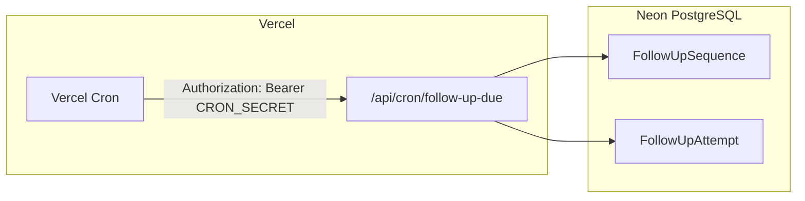

# Arquitectura: ejecución de seguimientos (follow-ups)

Resumen operativo alineado a **`docs/decisions/slice-s06-job-runner-followups.md`**.

## Flujo MVP (S07 en adelante)



1. **Cron** dispara la ruta protegida (no es pública).
2. El handler llama al **servicio de dominio** (misma lógica que luego podría usar un worker BullMQ).
3. Se actualizan filas en **Neon** con transacciones e idempotencia.

## Checklist 👤 (una vez por entorno)

| Paso | Dónde |
|------|--------|
| Definir `CRON_SECRET` (secreto largo) | Vercel → Environment Variables |
| Configurar cron en `vercel.json` o panel Vercel | Cron expression (p. ej. cada 5 min) |
| Verificar que la URL del cron apunta al proyecto correcto | Vercel → Cron Jobs |

## Prueba manual (desarrollo)

Con la app en marcha y `CRON_SECRET` en `.env`:

```bash
curl -sS -H "Authorization: Bearer $CRON_SECRET" "http://localhost:3000/api/cron/follow-up-due"
```

Respuesta JSON: `sequencesExamined`, `attemptsCreated`, `skipped`.

## Evolución: BullMQ + Redis

Cuando el volumen lo exija:

- Desplegar **worker Node** (Railway, Fly, etc.) con `REDIS_URL`.
- Encolar jobs desde la misma lógica de dominio o desde un adaptador fino.
- Mantener **Neon** como persistencia de estado de secuencias e intentos.

## Qué no hacer

- No ejecutar bucles largos sin límite en un único request serverless.
- No duplicar envíos por falta de idempotencia en el tick del cron.
