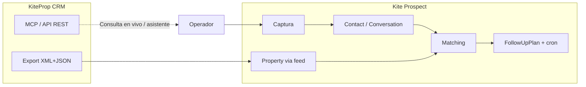

# Ejemplos de consultas KiteProp → flujo en Kite Prospect (simulado)

**Propósito:** entender la **lógica** de punta a punta: qué haría **Kite Prospect** ante consultas típicas del mundo KiteProp, **sin ejecutar envíos reales**. Incluye **roadmap temporal** (horas entre pasos) alineado a `processDueFollowUps` y a las plantillas de `docs/decisions/follow-up-plans-real-estate-templates.md`.

**Datos de ejemplo:** los códigos y títulos siguientes ilustran un snapshot tomado desde una **API CRM de demo** (no documentamos ni fijamos `www.kiteprop.com` como origen). Los números pueden no coincidir con tu entorno. Política: `docs/decisions/kiteprop-frontera-demo-y-produccion.md`.

---

## 1. Dos formas de “ver propiedades reales”

| Camino | Dónde | Uso en Kite Prospect hoy |
|--------|--------|---------------------------|
| **API REST / MCP** (`search_properties`, etc.) | KiteProp en vivo | Asistente en Cursor, integraciones, análisis. **No** alimenta automáticamente la tabla `Property` del tenant. |
| **Feed XML/JSON** (`Account.config.kitepropFeed`) | Exports del CRM | Sync periódico o manual → filas `Property` con `externalSource = "kiteprop"` → **matching v0** y recomendaciones sin inventar datos. Ver `docs/decisions/slice-s22-kiteprop-property-feed.md`. |

**Conclusión:** el **matching y el WA desde ficha** usan el inventario **sincronizado por feed**. El **MCP/API** sirve para **buscar en vivo** en KiteProp (operación, due diligence, copiar códigos reales a planes). Unificar ambos en un solo flujo automático sería **Fase 2 / integración** explícita (no prometido en el MVP actual).

**Snapshot real (dashboard):** ~177 propiedades en venta, ~1 en alquiler, miles de mensajes y contactos en ese tenant (números orientativos del día del snapshot).

---

## 2. Reglas de tiempos (recordatorio)

- Al **iniciar** la secuencia, `nextAttemptAt = ahora` → el **primer** paso corre cuando el cron toma la secuencia (en Vercel Hobby, hasta ~24 h entre corridas; en prueba manual, en minutos).
- Tras ejecutar el paso en índice `i`, el siguiente disparo es **`ahora + delayHours` del paso `i+1`** (ver código en `process-due-follow-ups.ts`).
- El `delayHours` del **paso 0** no retrasa el primer disparo; retrasa solo si se modelara distinto (hoy no).

En las tablas usamos **T+0h, T+24h…** como **tiempos lógicos desde el momento en que el cron ejecutó cada paso** (no el reloj wall-clock exacto en producción).

---

## 3. Cinco consultas ejemplo y roadmap ejecutado (simulación)

Plan base para los escenarios 1–4: plantilla **“Reactivación corta (3)”** (WhatsApp → WhatsApp → email):

| Paso | `delayHours` (siguiente) | Canal | Idea del `objective` |
|------|---------------------------|--------|----------------------|
| 0 | 24 | `whatsapp` | Saludo + validar interés + pedir zona/presupuesto |
| 1 | 72 | `whatsapp` | Ofrecer opciones reales del inventario / refinar |
| 2 | — | `email` | Cierre suave (en MVP sin Resend → **tarea** en ficha) |

**No se pushea nada en esta doc:** solo se muestra el texto **típico** que llevaría `objective`.

---

### Ejemplo A — “Casa o terreno cerca de Funes / Rosario”

**Consulta tipo lead:** “Busco terreno o casa en Fincas Ros o Funes, presupuesto acotado.”

**Propiedades reales (KiteProp API) alineables al discurso:**

| Código | Tipo | Título (resumido) |
|--------|------|---------------------|
| **KP487144** | `residential_lands` | Terreno 374 m² Fincas de Ybarlucea, escritura inmediata |
| **KP487132** | `houses` | Terreno 360 m² Fincas Ros, cerca de Funes |
| **KP487117** | `houses` | Terreno 557 m² Fincas Ros, cerca de Funes |

**Flujo Kite Prospect (lógico):**

1. Captura (`/lead`, widget, API o WA webhook) → `Contact` + `Conversation` + mensaje entrante.
2. Operador o IA asistida completa **perfil declarado** (zona Funes/Rosario, tipo terreno/casa).
3. **Matching** sobre `Property` del tenant que vengan del **feed** con esos `externalId`/zonas (si el feed está configurado).
4. **Iniciar seguimiento** (plan de 3 pasos) desde ficha.

**Roadmap ejecutado (simulado):**

| Momento | Acción en KP | Qué se “enviaría” (ejemplo) | Efecto en datos KP |
|---------|----------------|-----------------------------|---------------------|
| **T+0h** | Paso 0 WhatsApp | *“Hola, vimos tu consulta por zona Funes/Fincas. ¿Seguís buscando? ¿Preferís terreno para construir o casa lista?”* | `FollowUpAttempt` `outcome` sent/failed; auditoría paso |
| **T+24h** | Paso 1 WhatsApp | *“Te compartimos refs reales: KP487144 (lote Ybarlucea), KP487132 / KP487117 (Fincas Ros). ¿Cuál te interesa para visita?”* | Solo datos ya publicados; sin inventar precio/disponibilidad |
| **T+96h** *(24+72 desde paso 1)* | Paso 2 email o tarea | *“¿Seguimos la búsqueda o cerramos por ahora?”* | Si no hay Resend → tarea `followup` en ficha |

---

### Ejemplo B — “Permuto / complejo en venta”

**Consulta:** “Tengo interés en permutas, vi un complejo de dúplex.”

**Propiedad real ancla:**

| Código | Tipo | Título (resumido) |
|--------|------|---------------------|
| **KP497991** | `houses` | Complejo de dúplex + casa 2 dorm.; menciona permuta |

**Roadmap (misma plantilla 3 pasos):**

| Momento | Acción | Ejemplo de contenido |
|---------|--------|----------------------|
| T+0h | WA paso 0 | *“Gracias por escribirnos. ¿La permuta es sobre el aviso KP497991 o buscás alternativas en stock?”* |
| T+24h | WA paso 1 | *“Te confirmamos datos solo de inventario: KP497991 (estado en CRM). Si querés, coordinamos visita o derivamos a tasación.”* |
| T+96h | Email/tarea | Cierre suave igual que Ejemplo A |

---

### Ejemplo C — “Inmueble grande / inversión”

**Consulta:** “Busco algo importante, varias plantas, inversión.”

**Propiedad real ancla:**

| Código | Título (resumido) |
|--------|---------------------|
| **KP495025** | Importante inmueble 3 plantas |

**Roadmap:** mismo esquema; paso 1 puede citar **KP495025** si el match score supera umbral en KP.

---

### Ejemplo D — Reconsulta sin propiedad nueva (solo nurturing)

**Consulta:** “¿Siguen teniendo opciones en esa zona?” (lead ya existente).

**Flujo KP:** no crea propiedad nueva; actualiza conversación, quizá `LeadScore` recalculado, **secuencia** ya activa o nueva con plan corto.

**Roadmap:** T+0h mensaje de chequeo de interés; T+24h envío de **2–3 matches actuales** del feed; T+96h cierre.

---

### Ejemplo E — Pregunta analítica (solo KiteProp / MCP)

**Consulta:** “¿Cuántas consultas sin responder tengo y cómo está el stock?”

**Esto en KiteProp** se responde con **dashboard / estadísticas** (MCP: `get_dashboard_stats`, etc.), no con el motor de secuencias de KP.

**En Kite Prospect MVP:** el **dashboard** del tenant es propio (`getDashboardKpisForAccount`); **no** está cableado el mismo panel que el CRM KiteProp. Aquí el “roadmap” es solo: *abrir CRM o MCP → leer números → decisión humana*; **no** hay pasos de `FollowUpSequence` automáticos.

---

## 4. Diagrama resumido (mermaid)

---

## 5. Pendiente / producto (sin implementar aquí)

- Job que **refresque** `Property` desde API en lugar de solo feed, o **webhook** KiteProp → KP (definir contrato).
- En el asistente de **Cursor**, usar MCP para **elegir códigos** y pegarlos en `objective` de planes editados en `/dashboard/account/follow-up-plans`.

---

## Otros demos narrativos

- Cinco consultas ficticias por líneas **Avalon / Metro / Level / Innova** con recorrido simulado a **15 días**: [`demo-simulated-inquiries-avalon-metro-level-innova.md`](./demo-simulated-inquiries-avalon-metro-level-innova.md).

## Referencias

- `docs/decisions/follow-up-plans-real-estate-templates.md`
- `docs/decisions/slice-s22-kiteprop-property-feed.md`
- `docs/decisions/slice-s30-follow-up-start-from-contact.md`
- `apps/web/src/domains/followups/services/process-due-follow-ups.ts`
